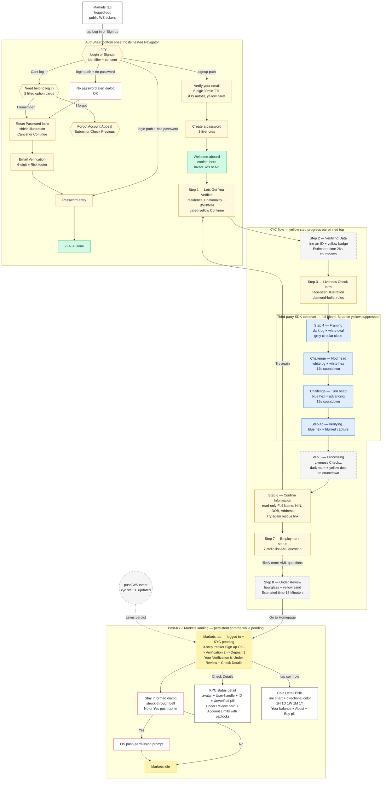
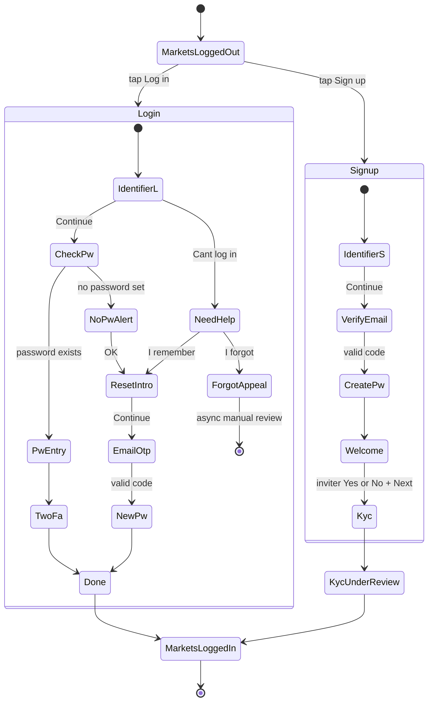
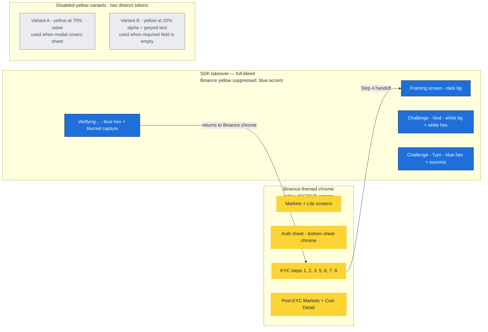

# Lite UX / System Flow — captured state (2026-04-21)

Mermaid diagrams of the Binance Lite flows captured in RESEARCH.md so far.
Covers: auth/signup → KYC → post-KYC landing → coin detail. Screens labelled with their chrome, primary action, and any async/external-system handoff.

---

## 1. High-level flow (screen graph)



---

## 2. Auth sheet — state machine



---

## 3. KYC — sequence (with external systems)

```mermaid
sequenceDiagram
    autonumber
    participant U as User
    participant App as Binance Lite app
    participant API as Binance backend
    participant Gov as Public gov database<br/>(NIMC / NIBSS for NIN/BVN)
    participant SDK as Liveness SDK<br/>(Sumsub-like)

    U->>App: Enter residence + nationality + BVN/NIN
    App->>API: submit identifier
    API->>Gov: lookup NIN/BVN
    Gov-->>API: name, DOB, address
    API-->>App: pending verdict
    Note over App: Step 2 — Verifying Data<br/>~26s ETA countdown

    App->>U: Show Liveness Check intro (rules)
    U->>App: Continue
    App->>SDK: start liveness session
    Note over App,SDK: Step 4 — full-bleed takeover<br/>Binance yellow suppressed; SDK blue accent

    SDK->>U: Put your face in the oval (framing)
    SDK->>U: Please nod your head (17s)
    U-->>SDK: gesture detected
    SDK->>U: Please turn your head (19s)<br/>hex border turns blue = advancing
    U-->>SDK: gesture detected
    SDK-->>App: Verifying... (hex + blurred capture)
    SDK-->>API: liveness result (score, frames)
    API-->>App: ingested

    Note over App: Step 5 — Processing Liveness Check...<br/>dark mark + yellow dots (transient)

    App->>U: Confirm Information<br/>(read-only: Name, NIN, DOB, Address)
    U->>App: Continue
    App->>U: Employment status (AML)
    U->>App: select option + Continue
    App->>API: submit full KYC bundle
    API-->>App: Under Review (15min ETA)

    par async verdict
        API-->>App: push/email kyc.status_updated
    and user explores
        U->>App: Markets / Coin Detail / etc.
    end
```

---

## 4. Theme / design-token takeover map



---

## 5. Key chrome variants observed

| Screen context | Header chrome | Notes |
|---|---|---|
| Markets (logged-out) | Binance mark + search + QR + gift | Bottom nav all 5 tabs visible; action-time gating |
| Markets (logged-in, KYC pending) | Same + 3-step tracker below | `Sign up ✓ — Verification [2] — Deposit [3]` persists until first deposit |
| Auth sheet entry | Title + top-right close X (login) / support+X (signup) | Bottom-sheet chrome, no back |
| Mid-auth flow | ← back + 🎧 support + × close | Back only appears past entry |
| Post-commit (Welcome, Under Review) | × close only | Cannot reverse |
| KYC during SDK | Grey circular × on dark / plain × on white | Adapts to background; no support |
| Coin Detail | ← back + 🔔 alert + ⭐ star | Minimal, no title in header |
| KYC status detail | Pill-grouped `⋯ | ×` | Combined action pill — unique to identity/detail screens |

---

## 6. Async ETA pattern — two scales

| Scale | Visual | Used at |
|---|---|---|
| Seconds | Line-art illustration + `Estimated time:` label + **tabular `26s` countdown** | KYC step 2 (public-database lookup) |
| Minutes | Hourglass illustration + stacked `Estimated time` / `15 Minute(s)` static label | KYC step 8 (Under Review full-screen) |
| Minutes, inline | Compact card with `Estimated review time: 15 Minute(s)` one-line bold label+value | KYC status detail card |
| Transient | Dark mark + yellow dots, no countdown | KYC step 5 (post-SDK handoff) |
| SDK-themed | Blue hex + blurred capture + `Verifying...` ellipsis | Step 4b (SDK final verdict) |

---

## 7. Coverage legend

- ✅ Fully captured: signup identifier → email OTP → password → Welcome → KYC step 1-8 → Markets landing → KYC detail → Coin Detail (BNB, zero-balance).
- ⚠️ Partial: Login branch (no-password alert + reset intro + email verify captured; happy-path password entry + 2FA not yet).
- ❌ Not yet captured: Login happy path, 2FA setup, post-KYC-approved state, Deposit flow, Trade bottom sheet, Convert, Portfolio, Square, Discover sub-screens, Profile tab.
